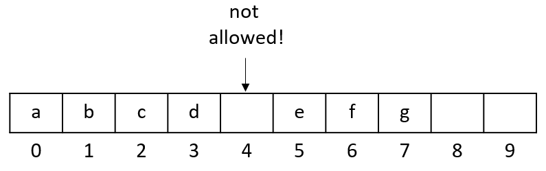

# Creating An Array-Based Data Structure
The goal in this first assignment is to write an implementation of a 
new data structure. Your structure will conform to an interface which 
describes the Abstract Data Type (ADT) for that structure. We will 
develop a structure based on a mathematical set (read more here: 
https://www.mathsisfun.com/sets/sets-introduction.html)

## Objectives
Here is what we'd like you take out of this assignment.

Course
- Develop a list, stack or queue data structure based on linked lists or static arrays.

Assignment
- To work with static arrays as a basis for a new data structure.
- To develop behavior that is defined in an interface.

## Getting Started
Inside the project files you will find the following files:
- **ICollection**: defines a basic collection with methods for adding, removing or discovering elements. 
- **ISet**: defines a set of elements, where no duplicates are allowed.
- **MySet**: A class that you will implement that uses both of the ICollection and ISet interfaces.
- **MyTests**: An optional driver class to test your set structure.
- **SetTests**: A formal group of JUnit 5 tests that you can use to verify your work.

Your job is to implement the MySet class so that it behaves like a set. The class should have the following
properties:
- The class should use the ISet and ICollection interfaces.
- The structure should store an array internally (as seen in class).
- The behavior of the methods in the class should follow the Javadocs provided in each interface.

## Using Arrays as an Underlying Structure
To implement your data structure you will be using an array internally as a field. This field will need to be 
updated as necessary when adding or removing elements from the structure you have been assigned.

All elements in the array should occupy lower indices of the array, with any extra capacity in the array being 
located in the upper indices.

There should be no gaps between elements in the array. When an element is removed from the array, then elements 
at higher indices should be shifted down to lower indices to occupy the gap.

The internal array should use all available positions as new elements are added.

When the internal array runs out of space for new elements, a new larger-sized array should be created and all elements 
in the original array copied over to the new structure. Then new elements can be added to unused spots in the 
replacement array.

_Note: For this assignment, each resize should double the length of the internal array._

Because this assignment is designed for you to work directly with arrays, it does not require the use of other data 
structures. You may not use any of the following classes for this assignment:
- The ArrayList class
- The Stack class
- Any classes that implement the Queue interface (LinkedList, LinkedBlockQueue, etc...)
- HashSet or TreeSet
- HashMap or TreeMap
- ...

Here is an example that shows this rule being broken, which would not be accepted:

The following implementation is correct and would be accepted:

## Implementing the ADT

The set structure will use two interfaces that describe how it should behave. The ICollection interface 
defines general behavior, and the ISet interface specific behavior only used by our set class.
The individual methods in each interface provided documentation (Javadocs) that explain how they should behave.

Your code should directly follow these descriptions, including:
- The names of methods.
- The method parameters.
- The return value of each method.
- Exceptions thrown in certain circumstances.
- Other requirements outlined in the Javadocs.

## Testing Your Work
You have been provided with Unit Test files that will verify your code.

Each data structure has their own tests to run.

Recall that when unit tests are executed, they have one of three possible outcomes:
- Pass (green) - The conditions of the test pass. The behavior of the unit has 
been verified.
- Fail (yellow) - One of the conditions of the test have failed. There are 
defects in the unit being tested.
- Error (red) - An error occurred by running the test. This is also considered a 
failure and indicates a defect in the unit.

Your aim should be for all tests to pass, which will be indicated by all green check marks in the Unit Test panel in 
your editor.

## Expectation: Linter Warnings & Javadocs
It is expected that your code is in a maintainable state upon submission. This means that there are no linter warnings 
in your project. You will need to set aside time to address any warnings before the submission deadline.

It is also expected that you document your code thoroughly. This includes regular code comments and Javadocs for 
formal documentation.

_Note: Any methods that use the @Override annotation are not required to include Javadocs and will not be 
flagged by the Linter._

## Expectation: Organized Project Files
It is expected that your project files are organized and easy to understand. The project should be using the
latest version of Java (as specified in class) and should not have any drastic changes to the package (folder)
structure under the /src directory. 

## Requirements
This section describes hard requirements for the assignment. Any deviation from these requirements will result in an assignment not being accepted. So please be aware.
- You may not use any preexisting classes from Java's Collections framework.
- You may not use the Arrays or Collections class as part of your implementation. This includes methods such as: 
    - Arrays.copy()
    - Arrays.fill()
    - Arrays.sort()
    - Collection.sort()
    - ...
